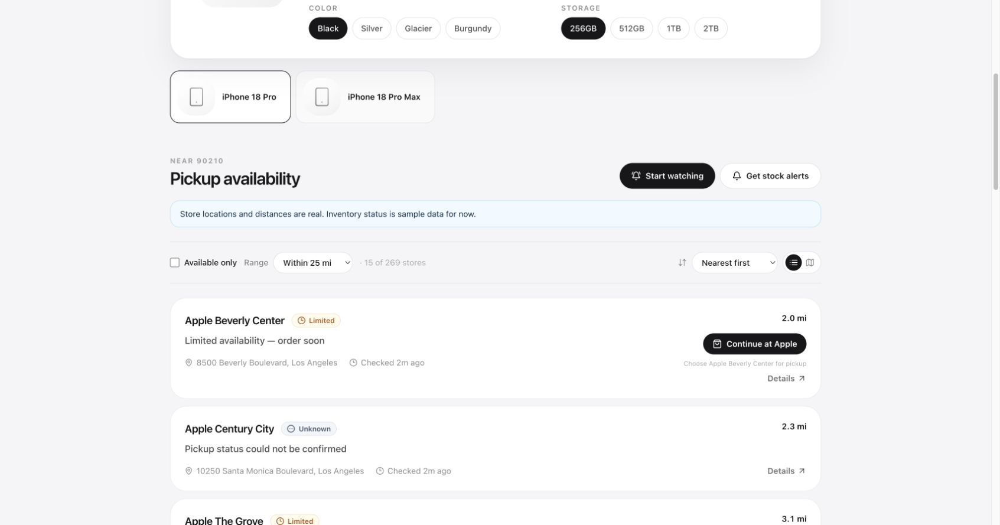
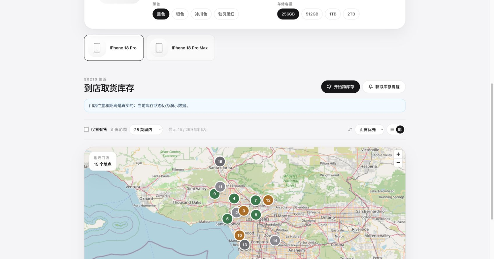

# Orchard

[English](README.md) | [简体中文](README.zh-CN.md)

Orchard 是一个精心设计的 iPhone 18 Pro 到店取货库存查询工具。用户输入美国邮政编码，选择准确的
iPhone 18 Pro 或 Pro Max 配置，即可查看附近 Apple Store、按 25/50/100 英里筛选、切换列表与
地图、比较库存，并前往 Apple 官方页面继续游客结账。界面支持中文和英文。

“蹲库存”模式会在页面保持打开时每 60 秒检查一次；浏览器允许通知后，发现有货门店会提醒用户。
Orchard 是独立工具，**与 Apple Inc. 无关联**。

默认 `demo` 模式使用免费的 Zippopotam.us 将美国邮政编码转换为坐标，再使用 Apple 公开的零售店
目录获取真实门店名称、地址、坐标和距离。库存状态仍是模拟数据，并会在界面中明确标注。Apple
没有提供稳定、公开且有文档的零售库存 API，因此实时库存接入仍属于实验功能。

当前产品范围有意限制为 iPhone 18 Pro 和 iPhone 18 Pro Max，包含四种颜色和四种容量。

## 应用截图

### 英文门店列表



### 中文地图视图



## 技术架构

- **前端：** Next.js、React、TypeScript、Tailwind CSS、TanStack Query、MapLibre GL JS、
  React Hook Form 和 Zod
- **后端：** FastAPI、Pydantic、HTTPX、SQLAlchemy 2、Alembic 和结构化日志
- **数据：** PostgreSQL 保存产品、门店、历史和提醒；Redis 保存短期库存与元数据缓存
- **数据提供层：** 统一的 `InventoryProvider` 接口，包含位置感知演示、离线 Mock 和实验性 Apple 实现
- **可靠性：** 请求合并、刷新频率限制、上游失败时使用旧缓存、严格超时且不进行激进重试

更多内容见[架构说明](docs/architecture.md)、[API 说明](docs/api.md)和
[Apple 数据源调研](docs/apple-provider.md)。

## 目录结构

```text
apps/
  api/                  FastAPI 服务、数据库迁移和测试
    app/
      api/routes/       HTTP 接口
      providers/        Apple、演示和离线 Mock 适配器
      services/         产品、门店、库存、缓存和限流
      repositories/     PostgreSQL 持久化
      schemas/          统一的公开数据模型
  web/                  Next.js 应用和组件测试
packages/
  shared/               前后端共享 Zod 合约
docs/                   架构、API 和 Apple 接入说明
docker-compose.yml      Web、API、PostgreSQL 和 Redis
```

## 使用 Docker 在本地启动（推荐）

需要安装 Docker Desktop，并支持 Docker Compose。

```bash
cp .env.example .env
docker compose up --build
```

启动后访问：

- Web：<http://localhost:3000>
- API：<http://localhost:8001>
- API 文档：<http://localhost:8001/docs>

默认使用演示模式。可以测试 `10001`、`94105` 和 `90210`，它们应分别显示纽约、旧金山和洛杉矶
附近的 Apple Store，而不是固定显示同一个地区。

停止服务：

```bash
docker compose down
```

如果还想删除本地数据库卷，请先确认数据不再需要，再运行 `docker compose down -v`。

## 不使用 Docker 启动

后端需要 Python 3.12+，前端需要 Node.js 20+。

前端：

```bash
npm install
npm run dev
```

另开一个终端启动后端：

```bash
cd apps/api
uv sync --extra dev
uv run uvicorn app.main:app --reload
```

PostgreSQL 和 Redis 需要单独启动，也可以只用 Compose 启动这两个服务。Redis 不可用时，开发环境
会回退到进程内缓存。若有意不使用 PostgreSQL，请设置 `PERSIST_INVENTORY=false`。

## 数据库迁移

API 容器启动时会自动运行 `alembic upgrade head`。手动运行：

```bash
cd apps/api
uv run alembic upgrade head
```

初始迁移会创建产品、产品配置、门店、追加式库存快照和提醒订阅表。

## 质量检查

```bash
npm run lint
npm run typecheck
npm test
npm run build

cd apps/api
uv run ruff check .
uv run mypy app
uv run pytest --cov=app
```

自动化测试不会请求 Apple。测试覆盖响应解析、状态归一化、缓存与请求合并、输入验证、API 行为、
界面库存状态和关键搜索校验。

## 使用 Codex 参与开发

把仓库目录作为 Codex 项目打开，然后可用类似下面的提示开始：

```text
请先阅读 AGENTS.md 和 README.zh-CN.md，并在修改前检查当前工作区。
实现 <你的功能>，保持中英文界面一致，并运行文档中的质量检查。
```

供代码代理使用的仓库规则位于 [`AGENTS.md`](AGENTS.md)。提交工作前请保持中英文文案一致，不要
提交 `.env`、Cookie、账号信息或密钥。改动位置搜索时，至少验证一个美国东海岸和一个西海岸邮政
编码。建议每个 Pull Request 只处理一个清晰主题，方便审查。

## 主要配置

复制 `.env.example` 后即可调整配置：

| 变量 | 默认值或作用 |
| --- | --- |
| `INVENTORY_PROVIDER` | `demo`：真实门店位置和模拟库存；`mock`：完全离线；`apple`：实验性实时库存 |
| `POSTAL_LOOKUP_BASE_URL` | 演示模式使用的免费邮政编码坐标服务 |
| `APPLE_GRAPHQL_PATH`, `APPLE_STORE_SEARCH_QUERY_ID` | Apple 公开零售店目录查询配置 |
| `APPLE_FULFILLMENT_PATH` | 外置配置的、无官方文档的库存路径 |
| `INVENTORY_CACHE_TTL_SECONDS` | 库存缓存 60 秒 |
| `INVENTORY_STALE_TTL_SECONDS` | 上游失败时最多使用 15 分钟旧缓存 |
| `STORE_CACHE_TTL_SECONDS` | 门店目录缓存 24 小时 |
| `DATABASE_URL`, `REDIS_URL` | 数据库和缓存连接 |
| `NEXT_PUBLIC_MAP_TILE_URL` | 地图瓦片地址；本地轻量使用时默认为 OpenStreetMap |

请勿把 Apple Cookie、Apple 账号信息、私有请求头或任何密钥加入配置或提交到仓库。

## 已知限制

- `demo` 模式的库存状态是模拟的；门店位置和距离来自邮政编码中心点与 Apple 公开零售店目录。
- 默认 OpenStreetMap 瓦片服务适合本地轻量使用，但没有可用性保证；正式大流量部署应配置专用服务。
- 提醒会保存，但服务器端邮件发送和定时检查仍是预留接口。
- 浏览器“蹲库存”只在页面保持打开时运行。
- 多实例部署前，应把请求合并锁和限流状态移到 Redis。
- 当前没有用户认证；提醒列表接口仅适合作为开发阶段的管理接口。

## 后续方向

1. 建立合规、可定期复核的产品编号目录更新流程。
2. 添加用户认证、提醒所有权和隐私控制。
3. 添加基于 Redis 的分布式锁与共享滑动窗口限流。
4. 使用轻量任务进程定时检查库存并接入交易邮件服务。
5. 添加库存历史图、补货概率和更完整的浏览器端到端测试。
